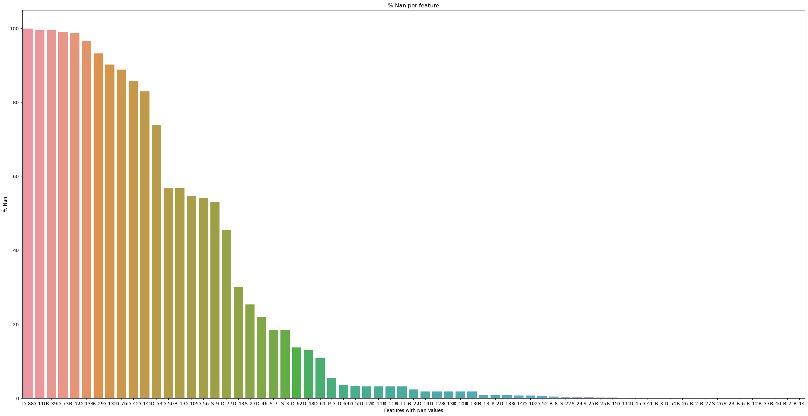

# **Modelagem de crédito (Amex_prediction Kaggle)**
=============================
## Introdução

O objetivo desse trabalho é identificar dentre todos os clientes quais irão pagar suas faturas e quais não irão pagar, comumente chamado de default.
Algumas caractéristicas do dataset disponibilizado pela American Express:

1. 5531451 entradas
2. 191 features, que estão divididas em:
   * D_* = Delinquency variables
   * P_* = Payment variables
   * S_* = Spend variables
   * B_* = Balance variables
   * R_* = Risk variables
3. Dataset desbalanceado *como esperado*: 25% clientes default

obs -> Não temos outras informações sobre os detalhes de cada feature. Somente as breves descrições acima. E isso é importante, explicarei melhor a frente.

-----

## Análise Descritiva 

### Distribuição da target

Como citado anteriormente, o dataset é desbalanceado, porém ainda temos em torno de 25% de default(não pagadores)

### Valores nulos

Temos 191 features -> Sendo que:

1 - Customer_Id
2 - DateTime
3 - Target

Restando 188 features divididas nas categorias explicadas anteriormente.

Dessas, 67 features contém valores Nan variando como mostrado abaixo

Diversos valores com porcentamgem maior que 50%:

* 'D_88', 'D_110', 'B_39',  'D_73', 'B_42', 'D_134', 'B_29', 'D_132', 'D_76', 'D_42', 'D_142', 'D_53', 'D_50', 'B_17', 'D_105', 'D_56', 'S_9'

#### Importante notar que, como não temos as explicações das váriaveis, é imprudente assumir que a deleção das mesmas seja a melhor saída. Faremos uma análise de WOE & IV mais para frente para determinar o peso de todas

Outro ponto importante notado pelo usuário **[Raddar](https://www.kaggle.com/competitions/amex-default-prediction/discussion/328514)** no Kaggle, foi inserção de ruídos nos dados **float**. Esse ruído que varia entre 0-0.01 foi removido desse dataset no ínicio, o que ajuda a diminuir seu tamanho e otimizando as atividades computacionais.

#### Traduzindo a informação da limpeza:
* Originalmente tinhamos 188 float/categoricas features. Essas foram transformadas para:
    * 95 np.int8/np.int16 types
    * 93 np.float34 types

    * Dados de treino originais -> **CSV = 16.39gb**
    * Dados retirado ruído e downcast de variáveis -> **PARQUET = 1.7gb**

Prediction of default for credit card issuer
Project Organization
------------

    ├── LICENSE
    ├── Makefile           <- Makefile with commands like `make data` or `make train`
    ├── README.md          <- The top-level README for developers using this project.
    ├── data
    │   ├── external       <- Data from third party sources.
    │   ├── interim        <- Intermediate data that has been transformed.
    │   ├── processed      <- The final, canonical data sets for modeling.
    │   └── raw            <- The original, immutable data dump.
    │
    ├── docs               <- A default Sphinx project; see sphinx-doc.org for details
    │
    ├── models             <- Trained and serialized models, model predictions, or model summaries
    │
    ├── notebooks          <- Jupyter notebooks. Naming convention is a number (for ordering),
    │                         the creator's initials, and a short `-` delimited description, e.g.
    │                         `1.0-jqp-initial-data-exploration`.
    │
    ├── references         <- Data dictionaries, manuals, and all other explanatory materials.
    │
    ├── reports            <- Generated analysis as HTML, PDF, LaTeX, etc.
    │   └── figures        <- Generated graphics and figures to be used in reporting
    │
    ├── requirements.txt   <- The requirements file for reproducing the analysis environment, e.g.
    │                         generated with `pip freeze > requirements.txt`
    │
    ├── setup.py           <- makes project pip installable (pip install -e .) so src can be imported
    ├── src                <- Source code for use in this project.
    │   ├── __init__.py    <- Makes src a Python module
    │   │
    │   ├── data           <- Scripts to download or generate data
    │   │   └── make_dataset.py
    │   │
    │   ├── features       <- Scripts to turn raw data into features for modeling
    │   │   └── build_features.py
    │   │
    │   ├── models         <- Scripts to train models and then use trained models to make
    │   │   │                 predictions
    │   │   ├── predict_model.py
    │   │   └── train_model.py
    │   │
    │   └── visualization  <- Scripts to create exploratory and results oriented visualizations
    │       └── visualize.py
    │
    └── tox.ini            <- tox file with settings for running tox; see tox.readthedocs.io

--------

<small>Project based on the <a target="_blank" href="https://drivendata.github.io/cookiecutter-data-science/">cookiecutter data science project template</a>. #cookiecutterdatascience</small>

