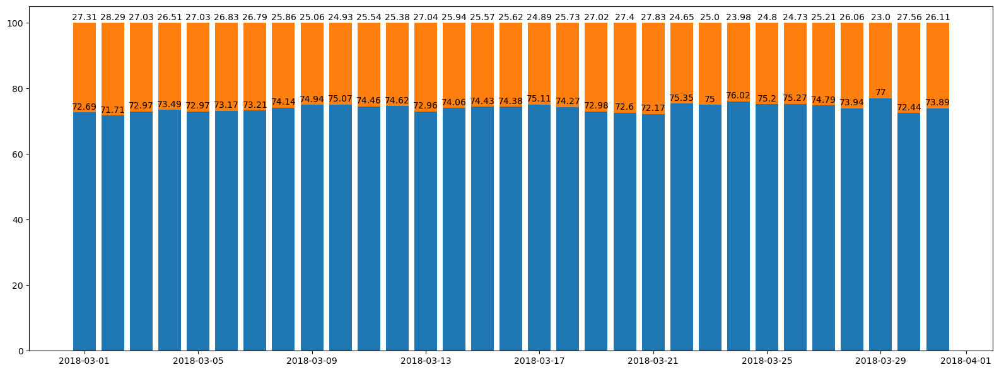
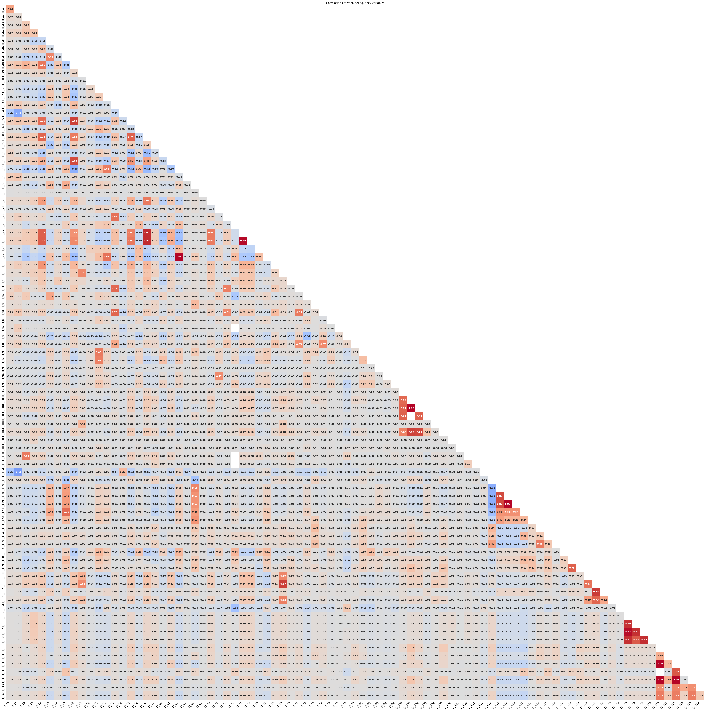
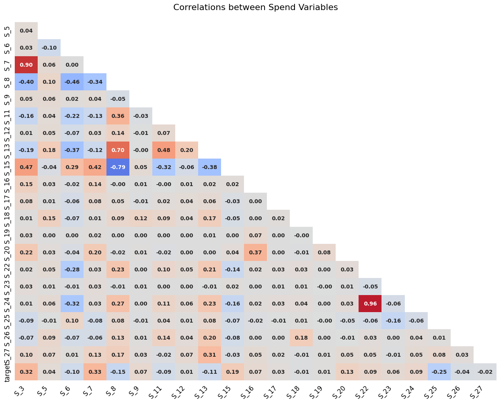
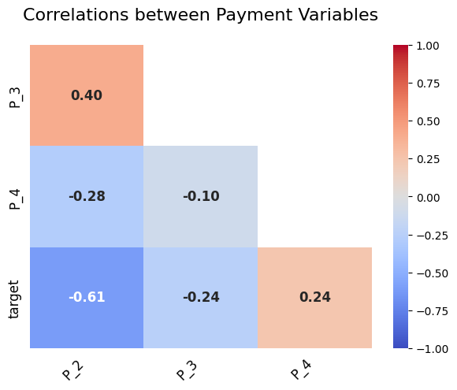
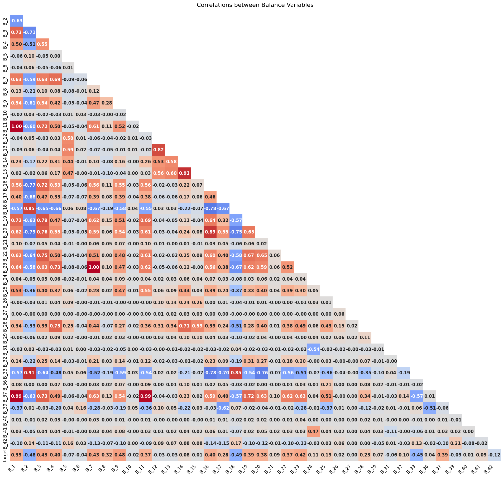

# **Modelagem de crédito (Amex_prediction Kaggle)**
=============================
## Introdução

O objetivo desse trabalho é identificar dentre todos os clientes quais irão pagar suas faturas e quais não irão pagar, comumente chamado de default.
Algumas características do dataset disponibilizado pela American Express:

1. 5531451 entradas
2. 191 features, que estão divididas em:
   * D_* = Delinquency variables
   * P_* = Payment variables
   * S_* = Spend variables
   * B_* = Balance variables
   * R_* = Risk variables
3. Dataset desbalanceado *como esperado*: 25% clientes default

obs -> Não temos outras informações sobre os detalhes de cada feature. Somente as breves descrições acima. E isso é importante, explicarei melhor a frente.

-----

## Análise Descritiva 

### Distribuição da target

Como citado anteriormente, o dataset é desbalanceado, porém ainda temos em torno de 25% de default(não pagadores)

### Valores nulos

Temos 191 features -> Sendo que:

1 - Customer_Id
2 - DateTime
3 - Target

Restando 188 features divididas nas categorias explicadas anteriormente.

Dessas, 67 features contém valores Nan variando como mostrado abaixo

Diversos valores com porcentagem maior que 50%:

* 'D_88', 'D_110', 'B_39',  'D_73', 'B_42', 'D_134', 'B_29', 'D_132', 'D_76', 'D_42', 'D_142', 'D_53', 'D_50', 'B_17', 'D_105', 'D_56', 'S_9'

#### Importante notar que, como não temos as explicações das variáveis, é imprudente assumir que a deleção das mesmas seja a melhor saída. Faremos uma análise de WOE & IV mais para frente para determinar o peso de todas

Outro ponto importante notado pelo usuário **[Raddar](https://www.kaggle.com/competitions/amex-default-prediction/discussion/328514)** no Kaggle, foi inserção de ruídos nos dados **float**. Esse ruído que varia entre 0-0.01 foi removido desse dataset no inicio, o que ajuda a diminuir seu tamanho e otimizando as atividades computacionais.

#### Traduzindo a informação da limpeza:
* Originalmente tínhamos 188 float/categóricas features. Essas foram transformadas para:
    * 95 np.int8/np.int16 types
    * 93 np.float34 types

    * Dados de treino originais -> **CSV = 16.39gb**
    * Dados retirado ruído e downcast de variáveis -> **PARQUET = 1.7gb**

### Analise de variáveis

#### S_2 - Variável do tempo

A distribuição do tempo não mostrou influência nos defaults. Provável que não tenha uma variável sazonal no fator "pagar a conta"

#### Olhando as variáveis por sua tipagem descrita no inicio
 * D_ = Delinquency variables

 
 *Foi observado alguns pares de Delinquency_variables altamente correlatas.* 

-----------

* S_ = Spend Variables

*Também observado pares de variáveis com alta correlação entre si.*

-----------

* P_ = Payment Variables

*Não foi observado nenhuma alta correlação*

-----------

* B_ = Balance Variables

*Diversas variáveis com alta correlação*

-----------------

*S_ = Risk Variables

*Também encontrados pares de variáveis com alta correlação*

## WOE e IV

De forma a avaliar o peso de cada feature no nosso dataset e sua relevância, irei utilizar duas formas de análise:

1. Weight Of Evidence(WOE) - Nos dá o poder preditivo de uma variável independente(uma feature qualquer do nosso dataset) com relação a variável dependente(nossa variável dummy-target). É dada pela fórmula
$$
WOE = ln(\frac {Distribution of Goods} { Distribution of Bads} )
$$

Resultado Positivo - Distribuição de bons > Ruins
Resultado Negativo - Distribuição de bons < Ruins

Por ser uma métrica oriunda da análise de risco em crédito, a notação de **Bom** & **Ruim**

Pode ser escrita também como:

$$
WOE = ln(\frac { \% of non-events} { \% of events} )
$$

Onde não eventos = Bons & Eventos = Ruins

A step by step calculation would be:

    1. Split data into parts - How much depend on your distribution
    2. Calcular o número de eventos e não eventos para cara grupo(bin)
    3. Calcular a % de eventos e não eventos para cada grupo
    4. Calcular o WOE baseado na fórmula acima

O porque do uso do WOE:

    * Nos ajuda a transformar um set de variáveis independentes e combinar features com um WOE similar e substituir seus valores pelos WOE.  

2. Information Value(IV) - Ela nos da um indicador de valor preditivo para cada variável, seria como um *Feature Importance* na saída do modelo. Sua formulação se dá baseado no WOE:

$$
IV = \sum( \% OfNon Events - \% of Events) * WOE
$$

E segue algumas regras:

    *  Information Value    |Variable Predictiveness
        Less than 0.02      |Not useful for prediction
        0.02 to 0.1         |Weak predictive Power
        0.1 to 0.3          |Medium predictive Power
        0.3 to 0.5          |Strong predictive Power
        >0.5                |Suspicious Predictive Power

Durante a analise, foram encontradas:

41 features com valor < 0.02 inúteis

101 features que estão entre fracas e fortes 0.02 < **feature** < 0.5

48 features suspeitosamente fortes > 0.5

Prediction of default for credit card issuer
Project Organization
------------

    ├── LICENSE
    ├── README.md          <- The top-level README for developers using this project.
    ├── data
    │   ├── external       <- Data from third party sources.
    │   ├── interim        <- Intermediate data that has been transformed.
    │   ├── processed      <- The final, canonical data sets for modeling.
    │   └── raw            <- The original, immutable data dump.
    │
    ├── docs               <- A default Sphinx project; see sphinx-doc.org for details
    │
    ├── models             <- Trained and serialized models, model predictions, or model summaries
    │
    ├── notebooks          <- Jupyter notebooks. Naming convention is a number (for ordering),
    │                         the creator's initials, and a short `-` delimited description, e.g.
    │                         `1.0-jqp-initial-data-exploration`.
    │
    ├── references         <- Data dictionaries, manuals, and all other explanatory materials.
    │
    ├── reports            <- Generated analysis as HTML, PDF, LaTeX, etc.
    │   └── figures        <- Generated graphics and figures to be used in reporting
    │
    ├── requirements.txt   <- The requirements file for reproducing the analysis environment, e.g.
    │                         generated with `pip freeze > requirements.txt`
    │
    ├── setup.py           <- makes project pip installable (pip install -e .) so src can be imported
    

--------

<small>Project based on the <a target="_blank" href="https://drivendata.github.io/cookiecutter-data-science/">cookiecutter data science project template</a>. #cookiecutterdatascience</small>

