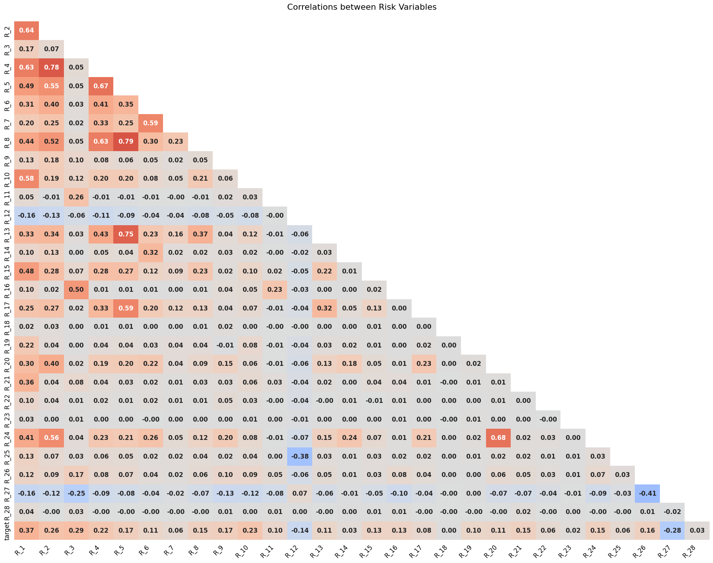

# **Modelagem de crédito (Amex_prediction Kaggle)**
=============================
## Introdução

O objetivo desse projeto é aplicar conhecimentos de análise de crédito a fim de prever clientes defaults em uma base de clientes fornecida pela American Express .
A iniciativa de realizar esse projeto veio após leitura de um livro sobre Credit Risk management.

Algumas características do dataset disponibilizado pela American Express:

1. 5.531.451 entradas
2. 191 features, que estão divididas em:
   * D_* = Delinquency variables
   * P_* = Payment variables
   * S_* = Spend variables
   * B_* = Balance variables
   * R_* = Risk variables
3. Dataset desbalanceado: 25% clientes default

obs -> Não temos outras informações sobre os detalhes de cada feature. Somente as breves descrições acima. E isso é importante, explicarei melhor a frente.

-----

## Análise Descritiva

### Distribuição da target

Como citado anteriormente, o dataset é desbalanceado, temos em torno de 25% de default(não pagadores)

Temos 191 features espalhadas nas categorias anteriormente citadas e 3 features distintas das demais, descritas abaixo:

1 - Customer_Id
2 - DateTime
3 - Target

### Valores nulos

Das 188 features restantes temos como análise de elementos nulos:

67 features contém valores Nan variando como mostrado abaixo

Diversos valores com porcentagem maior que 50%:

* 'D_88', 'D_110', 'B_39',  'D_73', 'B_42', 'D_134', 'B_29', 'D_132', 'D_76', 'D_42', 'D_142', 'D_53', 'D_50', 'B_17', 'D_105', 'D_56', 'S_9'

#### Importante notar que, como não temos as explicações das variáveis, é imprudente assumir que a deleção das mesmas seja a melhor saída. Faremos uma análise de WOE & IV mais para frente para determinar o peso de todas

### Analise de variáveis

#### S_2 - Variável do tempo

A distribuição temporal mostra uma leve sasonalidade nos defaults, sabemos que a cada 120 dias temos a classificação dos clientes que não pagaram suas faturas.

#### Olhando as variáveis por sua tipagem descrita no inicio

* D_ = Delinquency variables

 
 *Foi observado diversas variáveis com alto indice de correlação, D_77, D_62, D_131, D_130, D_79, D_49* 

-----------

* S_ = Spend Variables

*Também observado pares de variáveis com alta correlação entre si, S_7, S_9, S_13, S_15, S_22, S_24.*

-----------

* P_ = Payment Variables

*Não foi observado nenhuma alta correlação, atenção a uma variável correlação inversa*

-----------

* B_ = Balance Variables

*Diversas variáveis com alta correlação, B_11, B_1, B_37, B_3, B_18, B_23, B_7, B_20, B_19, B_18*

-----------------

* R_ = Risk Variables

*Também encontrados pares de variáveis com alta correlação, R_8, R_5, R_4, R_6*

## WOE e IV

De forma a avaliar o peso de cada feature no nosso dataset e sua relevância, irei utilizar duas formas de análise:

1. Weight Of Evidence(WOE) - Nos dá o poder preditivo de uma variável independente(uma feature qualquer do nosso dataset) com relação a variável dependente(nossa variável dummy-target). É dada pela fórmula
$$
WOE = ln(\frac {Distribution of Goods} { Distribution of Bads} )
$$

Resultado Positivo - Distribuição de bons > Ruins
Resultado Negativo - Distribuição de bons < Ruins

Por ser uma métrica oriunda da análise de risco em crédito, a notação de **Bom** & **Ruim**

Pode ser escrita também como:

$$
WOE = ln(\frac { \% of non-events} { \% of events} )
$$

Onde não eventos = Bons & Eventos = Ruins

Um passo a passo seria:

    1. Dividir os dados em partes(bins) - A quantidade depende da sua distribuição
    2. Calcular o número de eventos e não eventos para cara grupo(bin)
    3. Calcular a % de eventos e não eventos para cada grupo
    4. Calcular o WOE baseado na fórmula acima

O porque do uso do WOE:

    * Nos ajuda a transformar um set de variáveis independentes e combinar features com um WOE similar e substituir seus valores pelos WOE.  

2. Information Value(IV) - Ela nos da um indicador de valor preditivo para cada variável, seria como um *Feature Importance* na saída do modelo. Sua formulação se dá baseado no WOE:

$$
IV = \sum( \% OfNon Events - \% of Events) * WOE
$$

E segue algumas regras:

    *  Information Value    |Variable Predictiveness
        Less than 0.02      |Not useful for prediction
        0.02 to 0.1         |Weak predictive Power
        0.1 to 0.3          |Medium predictive Power
        0.3 to 0.5          |Strong predictive Power
        >0.5                |Suspicious Predictive Power

Durante a analise, foram encontradas:

* 41 features com valor < 0.02 inúteis

* 101 features que estão entre fracas e fortes 0.02 < **feature** < 0.5

* 48 features suspeitosamente fortes > 0.5

Com isso decidi fazer os seguintes experimentos:

1. Criar um dataset totalmente balanceado com os WoE Values
2. Um dataset seguindo as regras de IV - Retirando todas as features fracas/fortes que podem não ser relevantes para o modelo
3. Um dataset com os valores de WoE porém com as features selecionadas pelos valores IV
--------------------------------------------------------
------------------------

## Modelo, parâmetros e resultados

### Modelo e parâmetros

#### Baseline
1. Vou usar como base a distribuição entre as classes - **0.75**
    
#### Experimentação
Farei runs com LogisticRegression, RandomForestClassifier, XGBoost.
A Escolha da regressão logística se da exclusivamente pela origem do WOE & IV. Esses calculos foram criados pensando como uso a regressão logística.
Realizei alguns experimentos com outros, Logistic Regression, Random Forest:

#### Resultados RegLog:

1. Model all Features - **0.47**
2. Dataset WoE Balanced - **0.56**
3. Dataset IV Balanced - **0.44**
4. Dataset WoE Balanced & IV Selected Features - **0.52**

#### Resultados RandomForest:

1. Model all Features - **0.56**
2. Dataset WoE Balanced - **0.55**
3. Dataset IV Balanced - **0.43**
4. Dataset WoE Balanced & IV Selected Features - **0.54**

#### Resultados XGBoost:

1. Model all Features - **0.78**
2. Dataset WoE Balanced - **0.785**
3. Dataset IV Balanced - **0.73**
4. Dataset WoE Balanced & IV Selected Features - **0.72**

### Próximos passos:

1. PCA - para redução/adição de features
   

Prediction of default for credit card issuer
Project Organization
------------

    ├── LICENSE
    ├── README.md          <- The top-level README for developers using this project.
    ├── data
    │   ├── external       <- Data from third party sources.
    │   ├── interim        <- Intermediate data that has been transformed.
    │   ├── processed      <- The final, canonical data sets for modeling.
    │   └── raw            <- The original, immutable data dump.
    │
    ├── docs               <- A default Sphinx project; see sphinx-doc.org for details
    │
    ├── models             <- Trained and serialized models, model predictions, or model summaries
    │
    ├── notebooks          <- Jupyter notebooks. Naming convention is a number (for ordering),
    │                         the creator's initials, and a short `-` delimited description, e.g.
    │                         `1.0-jqp-initial-data-exploration`.
    │
    ├── references         <- Data dictionaries, manuals, and all other explanatory materials.
    │
    ├── reports            <- Generated analysis as HTML, PDF, LaTeX, etc.
    │   └── figures        <- Generated graphics and figures to be used in reporting
    │
    ├── requirements.txt   <- The requirements file for reproducing the analysis environment, e.g.
    │                         generated with `pip freeze > requirements.txt`
    │
    ├── setup.py           <- makes project pip installable (pip install -e .) so src can be imported
    

--------

<small>Project based on the <a target="_blank" href="https://drivendata.github.io/cookiecutter-data-science/">cookiecutter data science project template</a>. #cookiecutterdatascience</small>

