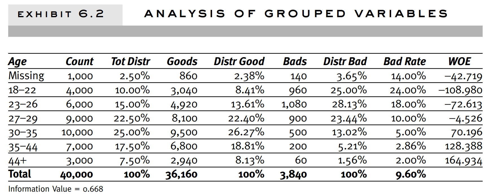

# Study based on Credit Risk Scorecard

## Missing values and outliers
1. Exclude all data with missing values—this is complete case analysis, and in most financial industry cases, will likely result in very
little data to work with.
2. Exclude characteristics or records that have significant (e.g.,
more than 50%) missing values from the model, especially if the
level of missing is expected to continue in the future.
3. >Include characteristics with missing values in the scorecard. The
“missing” can then be treated as a separate attribute, grouped,
and used in regression as an input. The scorecard can then be
allowed to assign weights to this attribute. In some cases this
assigned weight may be close to the “neutral” or mean value, but
in cases where the weight is closer to another attribute, it may
shed light on the exact nature of the missing values.
4. Impute missing values using statistical techniques.

## Initial Characretistic Analysis

• It offers an easier way to deal with outliers with interval variables,
and rare classes.
• Grouping makes it easy to understand relationships, and therefore
gain far more knowledge of the portfolio. A chart displaying the
relationship between attributes of a characteristic and performance is a much more powerful tool than a simple variable
strength statistic. It allows users to explain the nature of this relationship, in addition to the strength of the relationship.
• Nonlinear dependencies can be modeled with linear models.
• It allows unprecedented control over the development process—
by shaping the groups, one shapes the final composition of the
scorecard.
• The process of grouping characteristics allows the user to develop
insights into the behavior of risk predictors and increases knowledge of the portfolio, which can help in developing better strategies for portfolio management.

